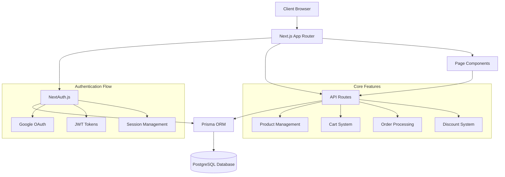
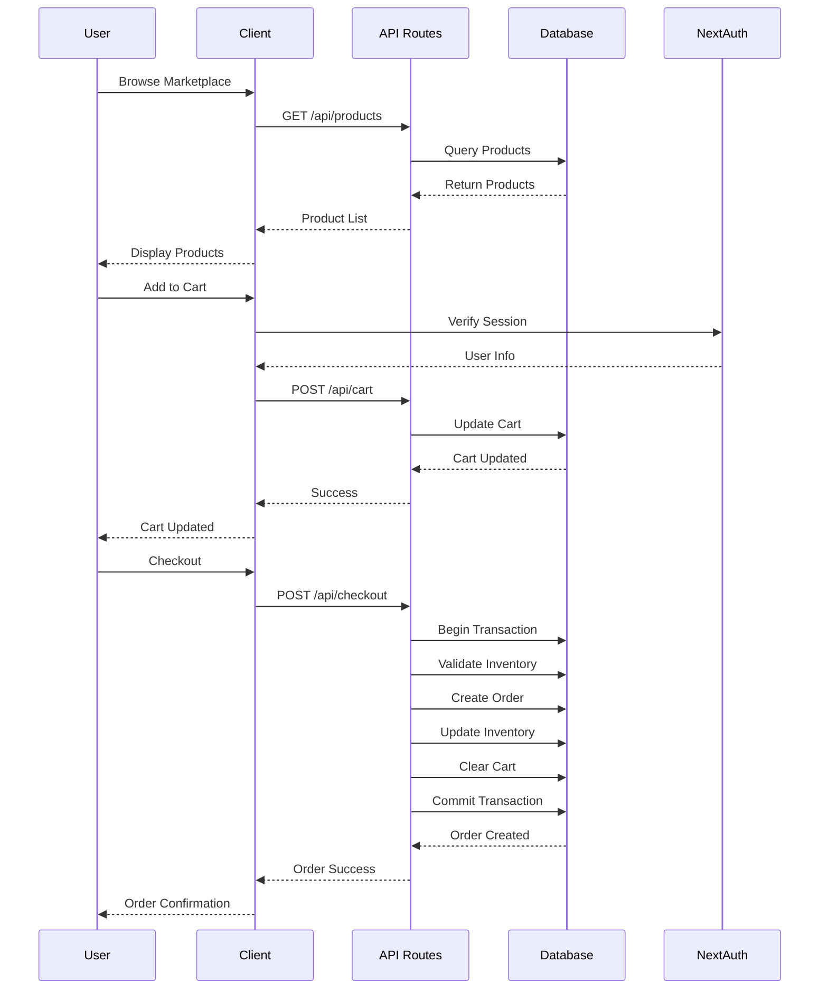
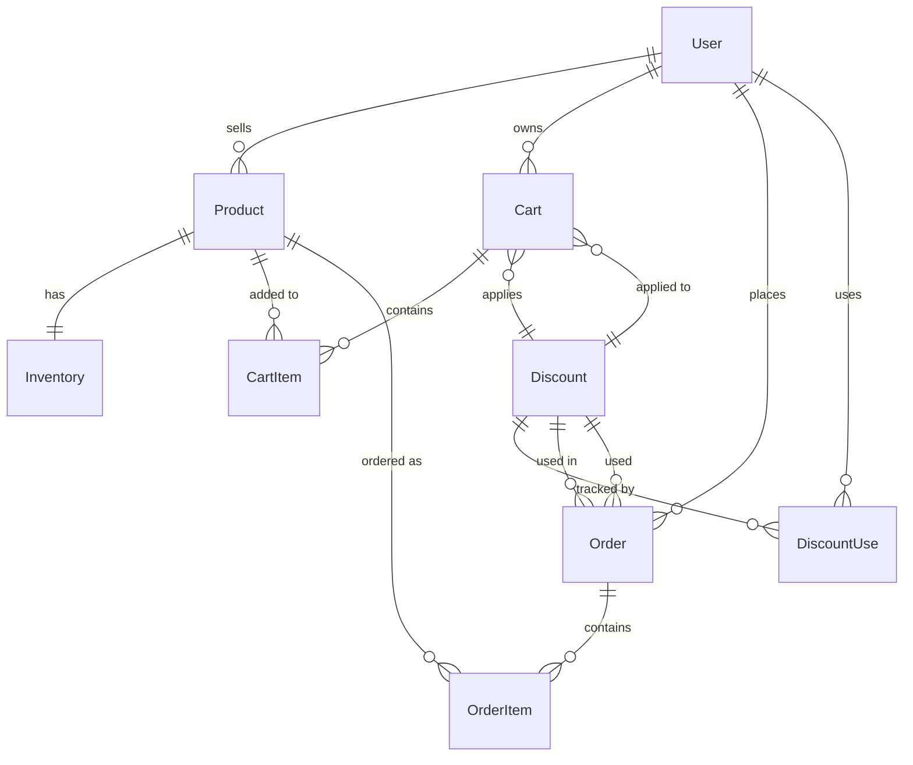

# Design Document

## Overview

The marketplace system will be built as an extension to the existing Next.js application with TypeScript, Prisma, and NextAuth.js. The system implements a comprehensive e-commerce platform where farmers can sell agricultural products and consumers can purchase them, with role-based access control, cart management, order processing, and a flexible discount system.

The architecture follows Next.js App Router patterns with server-side rendering, API routes for backend functionality, and client-side interactivity using React components styled with Tailwind CSS and shadcn/ui.

## Architecture

### High-Level Architecture



### Data Flow Architecture



## Components and Interfaces

### Database Schema Extensions

The existing Prisma schema will be extended with the following models:

#### User Model Extension
```prisma
enum UserRole {
  CONSUMER
  FARMER
}

model User {
  // ... existing fields
  role UserRole @default(CONSUMER)
  
  // New relations
  products Product[]
  carts Cart[]
  orders Order[]
  discountUses DiscountUse[]
}
```

#### Core E-commerce Models
```prisma
model Product {
  id String @id @default(cuid())
  title String
  slug String @unique
  description String?
  priceCents Int
  currency String @default("INR")
  images String[]
  category String
  sellerId String
  seller User @relation(fields: [sellerId], references: [id])
  
  inventory Inventory?
  cartItems CartItem[]
  orderItems OrderItem[]
  
  createdAt DateTime @default(now())
  updatedAt DateTime @updatedAt
}

model Inventory {
  id String @id @default(cuid())
  productId String @unique
  product Product @relation(fields: [productId], references: [id])
  quantity Int
  
  updatedAt DateTime @updatedAt
}

model Cart {
  id String @id @default(cuid())
  userId String @unique
  user User @relation(fields: [userId], references: [id])
  
  items CartItem[]
  discountId String?
  discount Discount? @relation(fields: [discountId], references: [id])
  
  createdAt DateTime @default(now())
  updatedAt DateTime @updatedAt
}

model CartItem {
  id String @id @default(cuid())
  cartId String
  cart Cart @relation(fields: [cartId], references: [id])
  productId String
  product Product @relation(fields: [productId], references: [id])
  quantity Int
  unitPriceCents Int // Snapshot price at add time
  
  createdAt DateTime @default(now())
}

model Order {
  id String @id @default(cuid())
  userId String
  user User @relation(fields: [userId], references: [id])
  
  items OrderItem[]
  subtotalCents Int
  discountCents Int @default(0)
  totalCents Int
  
  discountId String?
  discount Discount? @relation(fields: [discountId], references: [id])
  
  createdAt DateTime @default(now())
}

model OrderItem {
  id String @id @default(cuid())
  orderId String
  order Order @relation(fields: [orderId], references: [id])
  productId String
  product Product @relation(fields: [productId], references: [id])
  quantity Int
  unitPriceCents Int
  totalCents Int
}

enum DiscountType {
  PERCENT
  FIXED
}

model Discount {
  id String @id @default(cuid())
  code String @unique
  type DiscountType
  value Int // Percentage (1-100) or fixed amount in cents
  
  startsAt DateTime
  endsAt DateTime
  maxUses Int?
  perUserLimit Int?
  minSubtotalCents Int @default(0)
  allowedRoles UserRole[] // Empty array means ANY role
  isActive Boolean @default(true)
  
  uses DiscountUse[]
  carts Cart[]
  orders Order[]
  
  createdAt DateTime @default(now())
}

model DiscountUse {
  id String @id @default(cuid())
  discountId String
  discount Discount @relation(fields: [discountId], references: [id])
  userId String
  user User @relation(fields: [userId], references: [id])
  
  createdAt DateTime @default(now())
  
  @@unique([discountId, userId])
}
```

### API Route Structure

#### Authentication & Authorization
- `GET /api/auth/[...nextauth]` - NextAuth.js authentication
- `POST /api/seller/become` - Upgrade CONSUMER to FARMER role

#### Product Management
- `GET /api/products` - List products with filtering
- `POST /api/products` - Create product (FARMER only)
- `GET /api/products/[slug]` - Get product details
- `PATCH /api/products/[id]` - Update product/inventory (FARMER only)

#### Cart Management
- `GET /api/cart` - Get user's cart
- `POST /api/cart` - Add item to cart
- `PATCH /api/cart/[itemId]` - Update cart item quantity
- `DELETE /api/cart/[itemId]` - Remove cart item
- `POST /api/cart/apply-discount` - Apply discount to cart

#### Order Processing
- `POST /api/checkout` - Process checkout
- `GET /api/orders` - Get user's orders
- `GET /api/orders/seller` - Get seller's orders (FARMER only)

#### Discount System
- `POST /api/discounts/validate` - Validate discount code

### Component Architecture

#### Page Components
```
/marketplace - Product grid with search/filter
/product/[slug] - Product details with add to cart
/cart - Cart summary with discount input
/checkout - Checkout process
/orders - Consumer order history
/sell - Farmer dashboard
/sell/products - Product management
/sell/orders - Seller order management
```

#### Reusable Components
```
components/
├── auth/
│   ├── RoleGuard.tsx - Role-based access control
│   └── AuthButton.tsx - Login/logout functionality
├── marketplace/
│   ├── ProductGrid.tsx - Product listing grid
│   ├── ProductCard.tsx - Individual product card
│   ├── ProductFilters.tsx - Search and filter controls
│   └── ProductDetails.tsx - Detailed product view
├── cart/
│   ├── CartSummary.tsx - Cart items and totals
│   ├── CartItem.tsx - Individual cart item
│   └── DiscountInput.tsx - Discount code input
├── orders/
│   ├── OrderHistory.tsx - Order list
│   ├── OrderCard.tsx - Individual order display
│   └── OrderDetails.tsx - Detailed order view
└── seller/
    ├── ProductTable.tsx - Seller product management
    ├── OrderTable.tsx - Seller order management
    └── ProductForm.tsx - Create/edit product form
```

## Data Models

### Core Entities and Relationships



### Data Validation Rules

#### Product Validation
- Title: Required, 1-200 characters
- Slug: Auto-generated from title, unique
- Price: Positive integer in cents
- Category: Required, from predefined list
- Images: Array of valid URLs

#### Cart Validation
- Quantity: Positive integer, not exceeding inventory
- Unit price: Snapshot at add time, immutable
- User: Must be authenticated

#### Order Validation
- Items: Must have available inventory
- Totals: Calculated server-side, validated
- Discount: Must be valid at checkout time

#### Discount Validation
- Code: Unique, alphanumeric
- Dates: Start date before end date
- Value: Positive integer
- Limits: Non-negative integers

## Error Handling

### API Error Responses

All API routes will return consistent error responses:

```typescript
interface APIError {
  error: string;
  message: string;
  details?: any;
  statusCode: number;
}
```

### Error Categories

#### Authentication Errors (401)
- Invalid or expired session
- Missing authentication token
- User not found

#### Authorization Errors (403)
- Insufficient role permissions
- Access to unauthorized resources
- Role-specific feature access denied

#### Validation Errors (400)
- Invalid input data
- Missing required fields
- Business rule violations

#### Resource Errors (404)
- Product not found
- Order not found
- User not found

#### Business Logic Errors (422)
- Insufficient inventory
- Invalid discount code
- Cart validation failures

#### Server Errors (500)
- Database connection issues
- Transaction failures
- Unexpected system errors

### Error Handling Strategy

#### Client-Side Error Handling
```typescript
// Toast notifications for user feedback
import { toast } from "@/hooks/use-toast";

const handleAPIError = (error: APIError) => {
  toast({
    title: "Error",
    description: error.message,
    variant: "destructive",
  });
};
```

#### Server-Side Error Handling
```typescript
// Consistent error response utility
export const createErrorResponse = (
  message: string,
  statusCode: number,
  details?: any
) => {
  return NextResponse.json(
    { error: "API_ERROR", message, details },
    { status: statusCode }
  );
};
```

## Testing Strategy

### Unit Testing
- **Models**: Prisma model validation and relationships
- **Utilities**: Authentication helpers, discount calculations, money formatting
- **Components**: React component rendering and interactions
- **API Logic**: Business logic functions and validation

### Integration Testing
- **API Routes**: End-to-end API functionality
- **Authentication Flow**: NextAuth.js integration
- **Database Operations**: Prisma queries and transactions
- **Cart Operations**: Add, update, remove items

### End-to-End Testing
- **User Journeys**: Complete marketplace workflows
- **Role-Based Access**: FARMER and CONSUMER user flows
- **Checkout Process**: Cart to order completion
- **Discount Application**: Discount code validation and application

### Test Data Strategy
- **Seed Scripts**: Consistent test data generation
- **Factory Functions**: Dynamic test data creation
- **Mock Services**: External service mocking
- **Database Cleanup**: Test isolation and cleanup

### Testing Tools
- **Jest**: Unit and integration testing
- **React Testing Library**: Component testing
- **Playwright**: End-to-end testing
- **Prisma Test Environment**: Database testing setup

The testing strategy ensures comprehensive coverage of all marketplace functionality while maintaining fast test execution and reliable test isolation.